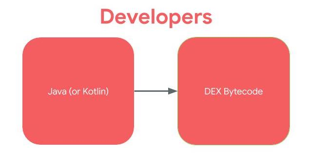
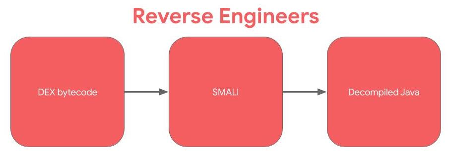

#### Table of Contents

1. [Introduction](index.html)
1. [Android Application Fundamentals](app_fundamentals.html)
1. [Getting Started with Reversing Android Apps](reversing_intro.html)
    * [Exercise 1](reversing_intro.html#exercise-1---beginning-re-with-jadx)
1. [Reverse Engineering Android Apps - DEX Bytecode](reversing_dex.html)
	* [Exercise 2](reversing_dex.html#exercise-2---reverse-engineer-the-dex)
	* [Exercise 3](reversing_dex.html#exercise-3---reverse-engineer-the-dex-to-identify-the-vuln)
	* [Exercise 4](reversing_dex.html#exercise-4---arbitrary-command-execution-take-2)
1. [Reverse Engineering Android Apps - Native Libraries](reversing_native_libs.html)
	* [Exercise 5](reversing_native_libs.html#exercise-5---find-the-address-of-the-native-function)
	* [Exercise 6](reversing_native_libs.html#exercise-6---find-and-reverse-the-native-function)
1. [Reverse Engineering Android Apps - Obfuscation](obfuscation.html)
	* [Exercise 7](obfuscation.html#exercise-7---string-deobfuscation)
1. [Conclusion](conclusion.html)


# 2. Android Application Fundamentals

## Build an App
One of my biggest suggestions for folks looking to reverse engineer things, whatever they may be, is to try and build what you want to reverse. In the case of Android, you're lucky because there are so many free resources available to build your first application. If you've never built an Android application before, I suggest you start there. Pick any of the available tutorials and videos that spark your interest and get to building. When you understand *how* a developer builds something, it makes it much easier to understand how to reverse engineer it. 

## Fundamentals Review
Great! You've built an app or learned basic Android app development principles. Here is a review of some of the important points. This ["Application Fundamentals" page](https://developer.android.com/guide/components/fundamentals.html) in the Android developers' docs is a great review.

* Android applications are in the _APK file format_. APK is basically a ZIP file. (You can rename the file extension to .zip and use unzip to open and see its contents.)
* APK Contents (Not exhaustive)
    * AndroidManifest.xml
    * META-INF/
        * Certificate lives here!
    * classes.dex
        * Dalvik bytecode for application in the DEX file format. This is the Java (or Kotlin) code that the application will run by default.
	* lib/
        * Native libraries for the application, by default, live here! Under the lib/ directory, there are the cpu-specific directories. Ex: armeabi, mips, 
    * assets/
        * Any other files that may be needed by the app. 
        * Additional native libraries or DEX files may be included here. This can happen especially when malware authors want to try and "hide" additional code, native or Dalvik, by not including it in the default locations.

## Dalvik & Smali
Most Android applications are written in Java. Kotlin is also supported and interoperable with Java. For ease, for the rest of this workshop, when I refer to "Java", you can assume that I mean "Java or Kotlin". Instead of the Java code being run in Java Virtual Machine (JVM) like desktop applications, in Android, the Java is compiled to the _Dalvik Executable (DEX) bytecode_ format. For earlier versions of Android, the bytecode was translated by the Dalvik virtual machine. For more recent versions of Android, the Android Runtime (ART) is used.
<br />
If developers, write in Java and the code is compiled to DEX bytecode, to reverse engineer, we work the opposite direction. 
<br />

<br />


Smali is the human readable version of Dalvik bytecode. Technically, Smali and baksmali are the name of the tools (assembler and disassembler, respectively), but in Android, we often use the term "Smali" to refer to instructions. If you've done reverse engineering or computer architecture on compiled C/C++ code. SMALI is like the assembly language: between the higher level source code and the bytecode. 

For the following Hello World Java code:
```
public static void printHelloWorld() {
	System.out.println("Hello World")
}
```

The Smali code would be:
```
.method public static printHelloWorld()V
	.registers 2
	sget-object v0, Ljava/lang/System;->out:Ljava/io/PrintStream;
	const-string v1, "Hello World"
	invoke-virtual {v0,v1}, Ljava/io/PrintStream;->println(Ljava/lang/String;)V
	return-void
.end method

```
The Smali instruction set is available [here](https://source.android.com/devices/tech/dalvik/dalvik-bytecode#instructions). 

Most often when reverse engineering Android applications, you will not need to work in Smali. Most applications can be lifted to an even higher level, decompiled Java. Like all tools, Java decompilers may have bugs. My suggestion to you is that whenever the decompiled Java output looks questionable, look at the Smali output. Work line by line with the instruction reference to figure out what the code is doing. 

To get the Smali from DEX, you can use the baksmali tool (disassembler) available at https://github.com/JesusFreke/smali/wiki. The smali tool will allow you to assemble smali back to DEX.

## Application Entry Points
One of the most important points of reverse engineering is knowing where to begin your analysis and entry points for code execution is an important part of that. 

### Launcher Activity
The launcher activity is what most people think of as the entry point to an Android application. The launcher activity is the activity that is started when a user clicks on the icon for an application. You can determine the launcher activity by looking at the application's manifest. The launcher activity will have the following MAIN and LAUNCHER intents listed.

Keep in mind that not every application will have a launcher activity, especially apps without a UI. Examples of applications without a UI (and thus a launcher activity) are pre-installed applications that perform services in the background, such as voicemail. 
```
<activity android:name=".LauncherActivity">
	<intent-filter>
    	<action android:name="android.intent.action.MAIN" />
        <category android:name="android.intent.category.LAUNCHER" />
    </intent-filter>
</activity>
```

### Services
[Services](https://developer.android.com/guide/components/services) run in the background without a UI. There are a myriad of ways that they can be started and thus are an entry point for applications. The default way that a service can be started as an entry point to an application is through [Intents](https://developer.android.com/guide/components/intents-filters). 

When the `startService` API is called to start a Service, the `onStart` method in the Service is executed. 

### Broadcast Receivers
Broadcasts can be thought of a messaging system and [broadcast receivers](https://developer.android.com/guide/components/broadcasts#receiving-broadcasts) are the listeners. If an application has registered a receiver for a specific broadcast, the code in that receiver is executed when the system sends the broadcast. There are 2 ways that an app can register a receiver: in the app's Manifest or dynamically registered in the app's code using the `registerReceiver()` API call. 

In both cases, to register the receiver, the intent filters for the receiver are set. These intent filters are the broadcasts that should trigger the receiver.

When the specific broadcasts are sent that the receiver is registered for are sent, `onReceive` in the BroadcastReceiver class is executed.

### Exported Components (Services & Activities)
Services and Activities can also be ["exported"](https://developer.android.com/guide/topics/manifest/service-element#exported), which allows other processes on the device to start the service or launch the activity. The components are exported by setting an element in the manifest like below. By default, `android:exported="false"` unless this element is set to true in the manifest or intent-filters are defined for the Activity or Service.
```
<service android:name=".ExampleExportedService" android:exported="true"/>
<activity android:name=".ExampleExportedActivity" android:exported="true"/>
````

### Application Subclass
Android applications can define a subclass of [Application](https://developer.android.com/reference/android/app/Application). Applications can, but do not have to define a custom subclass of Application. If an Android app defines a Application subclass, this class is instantiated prior to any other class in the application. 

If the `attachBaseContext` method is defined in the Application subclass, it is called first, before the `onCreate` method. 


[**NEXT** > 3. Getting Started with Reversing Android Apps](reversing_intro.html)